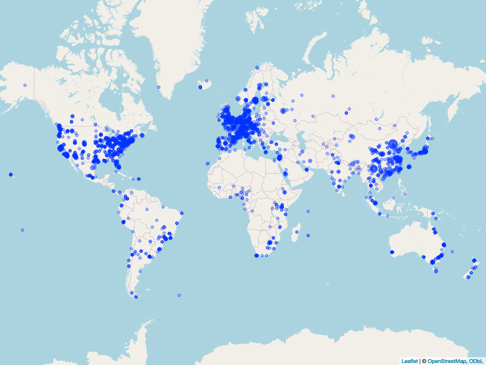

# Pub-Lab-Locator
Geographically locate and interactively visualize research institutes/labs contributed to a list of publications\
Input format required: List of publication in "Abstract (text)" format from Pubmed

## Requirements
1) Python
2) R: packages - dplyr, tidygeocoder, leaflet, htmlwidgets, mapview

## Case study - Molecular biology and Evolution (MBE)
I am interested in finding research centers primarily working on molecular evolution.\
Molecular biology and Evolution (https://academic.oup.com/mbe) is one of my favorite journal on this topic. I pulled out the list of publications in the last five years from this journal (May 2019 - May 2024).

The research centres with atleast 5 publications in MBE journal are marked here:\
(Note:The circle size is proportional to the logarithm (base 2) of the number of publications)\

## Interactive visualization of research centres !!!
[Names: Number of publication - Research centre name]\
https://github.com/Jayesh-Kumar-Sundaram/Pub-Lab-Locator/blob/main/04_plots/visualize_research_centers.html
[download]({{ site.baseurl }})

## Top research centres
Here is the list of top 50 research centers from around the world that has most number of publication in this journal:\
\
[Rank. Number of Publications - Research centre]
1) 68 - University of Chinese Academy of Sciences, Beijing, China.
2) 57 - Southern Marine Science and Engineering Guangdong Laboratory (Guangzhou), Guangzhou, China.
3) 52 - University of Chinese Academy of Sciences, Beijing, China.
4) 48 - Institut de Systématique, Evolution, Biodiversité (ISYEB), Sorbonne Université, CNRS, Museum National d'Histoire Naturelle, EPHE, Université des Antilles, Paris, France.
5) 38 - Swiss Institute of Bioinformatics, Lausanne, Switzerland.
6) 35 - Center for Excellence in Animal Evolution and Genetics, Chinese Academy of Sciences, Kunming, China.
7) 34 - Institute for Genomics and Evolutionary Medicine, Temple University, Philadelphia, PA, USA.
8) 32 - ICREA, Barcelona, Spain.
9) 30 - BGI Genomics, BGI-Shenzhen, Shenzhen, China.
10) 30 - School of Biological and Chemical Sciences, Queen Mary University of London, London, United Kingdom.
11) 30 - Center for Excellence in Animal Evolution and Genetics, Chinese Academy of Sciences, Kunming, China.
12) 29 - Department of Evolutionary Biology and Environmental Studies, University of Zurich, Zurich, Switzerland.
13) 27 - Department of Medical Biochemistry and Microbiology, Uppsala University, Uppsala, Sweden.
14) 26 - Institute of Evolutionary Biology, University of Edinburgh, Edinburgh, United Kingdom.
15) 24 - Department of Organismic and Evolutionary Biology, Harvard University, Cambridge, MA, USA.
16) 21 - Department of Microbiology, Immunology and Transplantation, Rega Institute, KU Leuven, Leuven, Belgium.
17) 21 - Laboratory of Evolutionary Genetics and Genomics, The Rockefeller University, New York, NY, USA.
18) 19 - Department of Biology, Pennsylvania State University, University Park, PA.
19) 19 - Department of Evolutionary Genetics, Max Planck Institute for Evolutionary Anthropology, Leipzig, Germany.
20) 19 - Department of Cell and Molecular Biology, Uppsala University, Uppsala, Sweden.
21) 19 - Department of Zoology, University of Oxford, Oxford, United Kingdom.
22) 19 - Department of Medical Biochemistry and Microbiology, Science for Life Laboratory, Uppsala University, Uppsala, Sweden.
23) 18 - Centre for Palaeogenetics, Stockholm, Sweden.
24) 18 - College of Horticulture, Nanjing Agricultural University, Nanjing, China.
25) 18 - CEA, CNRS, Institute for Integrative Biology of the Cell (I2BC), Université Paris-Saclay, Gif-sur-Yvette, France.
26) 18 - Department of Environmental Sciences, Zoology, University of Basel, Basel, Switzerland.
27) 17 - Department of Ecology and Evolution, University of Chicago, Chicago, IL.
28) 16 - Division of Cell and Developmental Biology, Medical University of Vienna, Vienna, Austria.
29) 16 - Department of Zoology, Faculty of Science, Charles University, Prague, Czech Republic.
30) 16 - Computational Molecular Evolution Group, Heidelberg Institute for Theoretical Studies, Heidelberg, Germany.
31) 16 - Center for Integrative Bioinformatics Vienna, Max Perutz Labs, University of Vienna and Medical University of Vienna, Vienna, Austria.
32) 16 - Department of Genetics, Evolution and Environment, University College London, London, United Kingdom.
33) 16 - MBE Press Office.
34) 15 - Wellcome Centre for Human Genetics, University of Oxford, Oxford, United Kingdom.
35) 15 - Laboratory of Genome and Epigenome Dynamics, Department of Animal Sciences, Graduate School of Bioagricultural Sciences, Nagoya University, Nagoya 464-8601, Japan.
36) 15 - School of Life Science and Technology, ShanghaiTech University, Shanghai, China.
37) 15 - Section for Ecology and Evolution, Department of Biology, University of Copenhagen, Copenhagen, Denmark.
38) 15 - Department of Liver Surgery and Transplantation Liver Cancer Institute, Zhongshan Hospital, Fudan University, Shanghai, China.
39) 15 - Department of Ecology and Evolutionary Biology, Yale University, New Haven, CT, USA.
40) 14 - Department of Life Sciences, Natural History Museum, London, United Kingdom.
41) 14 - Department of Ecology and Evolutionary Biology, University of Toronto, Toronto, ON, Canada.
42) 14 - BGI-Argo Seed Service (Wuhan) Co., Ltd, Wuhan, China.
43) 14 - CEFE UMR 5175, CNRS, Université de Montpellier, Université Paul-Valéry Montpellier, EPHE, Montpellier, France.
44) 14 - CNRS, Laboratoire de Biométrie et Biologie Évolutive UMR, Université de Lyon, Université Lyon 1, Villeurbanne, France.
45) 14 - British Antarctic Survey, Cambridge, United Kingdom.
46) 14 - Belozersky Institute of Physico-Chemical Biology, Lomonosov Moscow State University, Moscow, Russia.
47) 14 - Department of Biochemistry and Molecular Biology, Michigan State University, East Lansing, MI.
48) 13 - Institute of Ecology and Evolution, University of Bern, Bern, Switzerland.
49) 13 - Biomolecular Interactions, Max Planck Institute for Developmental Biology, Tübingen, Germany.
50) 13 - Department of Forest Sciences, University of Helsinki, Helsinki, Finland.

